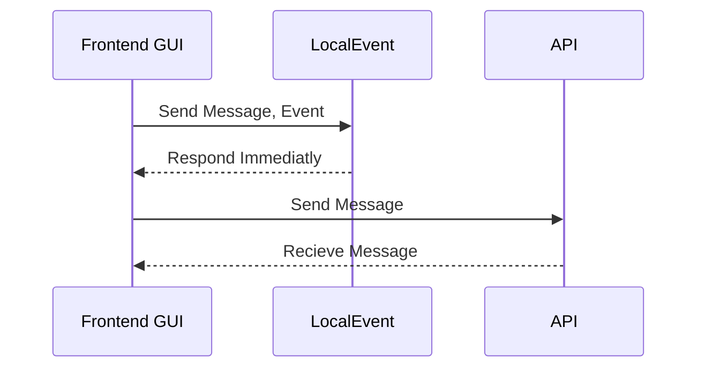

# Prerequisites

 - Visual Studio Code
 - Good knowledge of Angular.io / Typescript
 - Good practices and understanding

## Development practices
The developer should follow strictly defined practices
1.  **Naming convention** - Follow naming conventions.
2.  **Reusabillity** - Follow clear and resuable writing practice.
3.  **Simple code** - Simplyify the code if possible, do not over complication a simple code.
4.  **Commenting** - In some cases it is required to comment the method and the function.

## Logic

####  Description
 - **Frontend** GUI: Is the frontend user interface.
 - **LocalEvent**: Handles responses internally. 
 - **API**: Send messages to user in session.
 
## Commits

1. All commits must be done in a single dev-branch. After inspection they will be merged.

## Issues
Sk*pe: unnamed1514